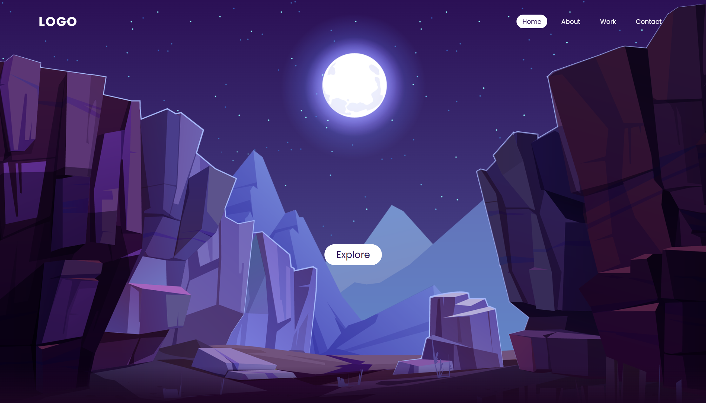

<h1 align="center"> Moon Light </h1>

Moon Light é um projeto com intuito de treinar tecnologias WEB.  

  <a href="#-tecnologias">Tecnologias</a>&nbsp;&nbsp;&nbsp;|&nbsp;&nbsp;&nbsp;
  <a href="#-projeto">Projeto</a>&nbsp;&nbsp;&nbsp;|&nbsp;&nbsp;&nbsp;
  <a href="#-layout">Layout</a>&nbsp;&nbsp;&nbsp;|&nbsp;&nbsp;&nbsp;
  <a href="#memo-licença">Licença</a>

  

 

  

## 🚀 Tecnologias

Esse projeto foi desenvolvido com as seguintes tecnologias:

- HTML e CSS
- JavaScript
- Git e Github

## 💻 Projeto

O Moon Light é um projeto para treinar o uso de efeito Parallax Scrolling em um website.

- [Visite o projeto online](https://tuliorafaelms.github.io/nlw-habits)

## 🔖 Layout

Image Source & Attribution

Origem do Vetor : [NESTE LINK](https://www.freepik.com). É necessário ter conta no [freepik](https://www.freepik.com/) para acessá-lo.

Vetor criado por upklyak : [NESTE LINK](https://www.freepik.com/free-vector/mountains-cleft-view-from-bottom-night-scenery-landscape-with-high-rocks-full-moon-with-stars-glowing-peaks_13194970.htm#page=1&query=Scene&position=38)

Download Imagem : [NESTE LINK](https://www.youtube.com/watch?v=4OiNwNWHGyo&t=0s)

## :memo: Licença

Disclaimer video is for educational purpose only. Copyright Disclaimer Under Section 107 of the Copyright Act 1976, allowance is made for "fair use" for purposes such as criticism, comment, news reporting, teaching, scholarship, and research. Fair use is a use permitted by copyright statute that might otherwise be infringing. Non-profit, educational or personal use tips the balance in favor of fair use

---

Feito por @OnlineTutorialsYT :wave: [Se inscreva no canal do Youtube!](https://www.youtube.com/@OnlineTutorialsYT)